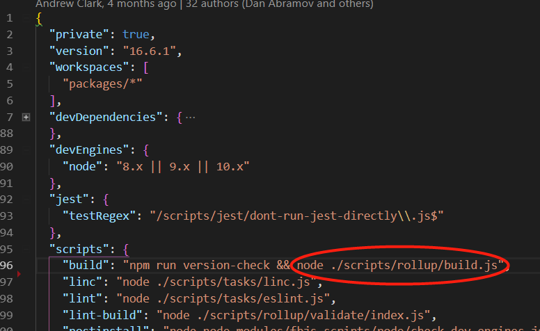
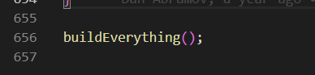
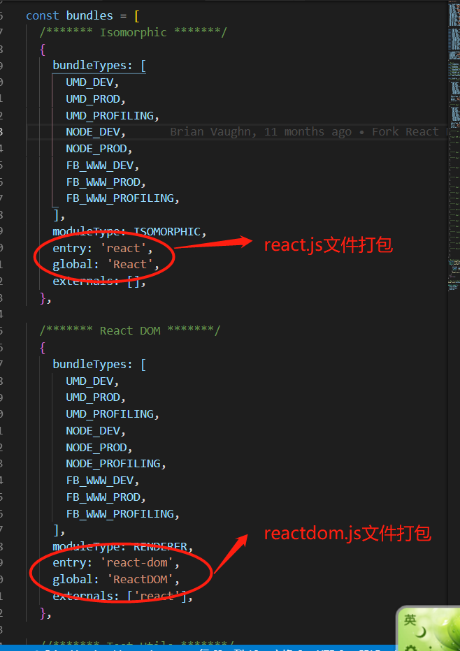

# 关于如何阅读调试react源码
阅读react源码的时候，如果能在关键地方输出一些调试信息，或者在关键地方debugger，对于理解react源码能起到事半功倍的效果。这里说一下我阅读调试react源码的方法。

步骤1：在GitHub上fork一份[react官方仓库](https://github.com/facebook/react)，用来做react源码阅读仓库

步骤2：把fork过来的仓库clone到自己本地，修改react的rollup打包文件。react源码使用rollup进行打包，从npm script入手开始查看和修改react的构建代码。

package.json截图如下

可以发现react的构建命令为npm run build，其中主要通过运行./scripts/rollup/build.js文件进行构建。运行一次npm run build命令，TODO: 缺少运行npm run build的截图

从相应路径打开build.js文件。大致浏览代码后发现最后一句代码就是构建源码的函数，截图如下：

找到buildEverything的函数定义，发现函数内对Bundles.bundles对象进行了遍历，遍历循环中调用了许多名为createBundle的函数，由函数名和参数名猜测该函数是构建不同版本（umd版本，node版本等）react代码的函数。我们调试react源码只需要umd版本即可。因此其他版本的构建可以注释掉。

继续找到Bundles.bundles变量的定义处（文件路径在./scripts/rollup/bundles.js），Bundles.bundles定义如下：

可以猜想bundles变量定义的是react仓库源码能够编译出的不同的bundle文件。而我们调试react源码，只需要react.js和react-dom.js这两个bundle文件。其他bundle文件可以不需要。

根据上述猜想，开始进行以下步骤：
1、在./scripts/rollup目录下创建study-build.js文件。在package.json文件中添加 study-build 命令，截图如下：

