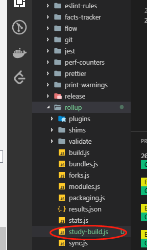

# 关于如何阅读调试react源码
阅读react源码的时候，如果能在关键地方**输出一些调试信息**，或者在**关键地方debugger**，对于理解react源码能起到事半功倍的效果。这里说一下我阅读调试react源码的方法。

## 自定义构建命令
步骤1：在GitHub上fork一份[react官方仓库](https://github.com/facebook/react)，用来做react源码阅读仓库

步骤2：把fork过来的仓库clone到自己本地，准备修改react的rollup打包文件（clone仓库后安装依赖使用yarn install，npm install会报错）。react源码使用rollup进行打包，从npm script入手开始查看和修改react的构建代码。   
react仓库的package.json截图如下

可以发现react的构建命令为npm run build，其中主要通过运行./scripts/rollup/build.js文件进行构建。运行一次npm run build命令，发现编译出了各种版本的不同的bundle文件。截图如下：

由于npm run build文件编译出了不同版本的不同bundle文件，所以运行时间非常长，在我电脑上大概跑了5、6分钟。

从相应路径打开build.js文件。大致浏览代码后发现最后一句代码就是构建源码的函数，截图如下：

找到**buildEverything**的函数定义，发现函数内对Bundles.bundles对象进行了遍历，遍历循环中调用了许多名为**createBundle**的函数，由函数名和参数名猜测该函数是构建不同版本（umd版本，node版本等）react代码的函数。我们调试react源码只需要**umd版本**即可。因此其他版本的构建应该可以注释掉。

继续找到**Bundles.bundles变量的定义**处（文件路径在./scripts/rollup/bundles.js），Bundles.bundles定义如下：

可以猜想bundles变量定义的是react仓库源码能够编译出的不同的bundle文件。而我们调试react源码，只需要react.js和react-dom.js这两个bundle文件。其他bundle文件可以不需要，所以其他的bundle文件定义应该可以舍去

根据上述猜想，开始以下步骤：
1. 在./scripts/rollup目录下创建study-build.js文件。在package.json文件中添加 study-build 命令，截图如下：

2. 将./scripts/rollup/build.js文件内容copy到study-build.js文件，然后找到buildEverything函数，将多余的bundle版本编译注释掉，截图如下：

3. 在study-build.js中文件中最后一句调用 buildEverything() 函数之前，覆盖掉Bundles.bundles的定义，让命令只编译react.js和react-dom.js两个bundles,截图如下：

4. 修改完毕后，运行npm run study-build命令，截图如下：

编译出来的文件可以在 ./build/dist 文件夹中找到

## 在编译结果中测试输出和debugger
1. 打开 ./packages/react/index.js 文件，这是react源码库的index文件。加上几句输出和debugger语句。

2. 重新运行npm run study-build命令，对源文件进行编译。编译后，打开 ./build/dist/react.development.js文件，搜索刚刚添加的输出和debugger语句，可以发现自己在源码中添加的语句已经被编译进bundle文件。

说明可以在源码中随意添加输出和debugger，只要添加完后重新编译然后在html中引入bundle文件即可。

有了能在react内部debuger和输出的能力，对后面阅读理解react源码有很大的帮助。

最后给一份在react.js内部进行debugger的截图

