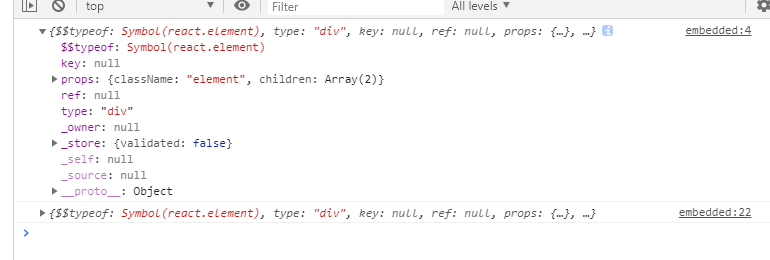
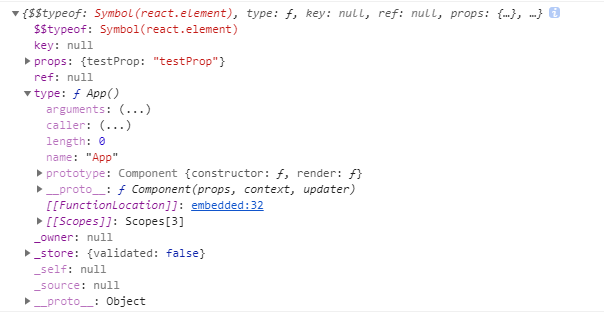

# react 元素与组件

## react 元素
react元素是react中最小的基本单位。通常用jsx语法来创建一个react元素。
```jsx
const element = <div className="element">I'm element</div>
```
react 元素是一个普通的javascript对象，一个react元素和界面上的**一部分DOM**对应，描述了这部分DOM的结构及渲染效果。

### 创建react元素的三种方法
创建react通常有以下三种方法
```jsx
// 方法1：JSX语法、
const element1 = <div className="element">I'm element</div>

// 方法2：使用React.createElement()
// const element2 = React.createElement(
//     'div',
//     [props],
//     [...children]
// )
const element2 = React.createElement(
  'div',
  { // props
    className: 'element'
  },
  "I'm ", // children1
  React.createElement( // children2
    'span',
    null,
    'element1'
  )
);

// 方法3：使用React.cloneElement()
const element3 = React.cloneElement({
  element2,
  {
    newProp: 'prop from clone'
  },
  'children from clone'
})
```
方法1属于jsx语法，被babel转译后就变成方法2。React.createElement方法简介如下，[文档点此进入](https://react.docschina.org/docs/react-api.html#createelement)：
```
React.createElement(
    type,
    [props],
    [...children]
)
```
type：既可以是一个html标签名称字符串(例如'div' 或 'span' )，也可以是一个 React component 类型(一个类或一个函数)。   
props: react元素的prop对象。当元素的type是一个React component 类型时，会被传入React component   
...children：react元素的子元素    

方法2用来clone一个react element。React.cloneElement方法简介如下，[文档点此进入](https://react.docschina.org/docs/react-api.html#cloneelement)：
```
React.cloneElement(
  element,
  [props],
  [...children]
)
```
以 element 作为起点，克隆并返回一个新的React元素(React Element)。生成的元素将会拥有原始元素props与新props的浅合并。新的子级会替换现有的子级。来自原始元素的 key 和 ref 将会保留。

### react元素的实质
react元素实际上是一个普通的js对象，用来描述一个虚拟节点。截图如下：


React 元素可以分为两类：**DOM类型的元素**和**组件类型的元素**。DOM类型的元素使用像h1、div、p等DOM节点创建React 元素，前面的例子就是一个DOM类型的元素；   

组件类型的元素使用React 组件创建React 元素。如下截图，一个组件类型的react元素，可以发现其type是组件的构造函数。


## react 组件
组件可以将UI切分成一些独立的、可复用的部件，这样你就只需专注于构建每一个单独的部件。

组件从概念上看就像是函数，它可以接收任意的输入值（称之为“props”），并返回一个需要在页面上展示的React元素。

### 创建组件的两种方式
```jsx
// 方式1：函数定义
function App(props) {
  return <h1>In App, {props.name}</h1>;
}

// 方法2：es6 class定义
class App extends React.Component {
  render() {
    return <h1>In App, {this.props.name}</h1>;
  }
}
```

## react 组件与元素的关系
* react组件包含着用户自定义的各种逻辑，但是描述视图的jsx由react元素构成
* react组件想要挂载到页面，必须被“包装”成react元素，通过ReactDOM.render函数挂载到浏览器dom
* react组件最核心的作用是返回react元素（render函数）
* react元素可以的类型可以是一个react组件，也可以是一个dom节点

**最终总结：React 组件的复用，本质上是为了复用这个组件返回的React元素（同时也复用了React组件内的自定义逻辑），React 元素是React 应用的最基础组成单位**

