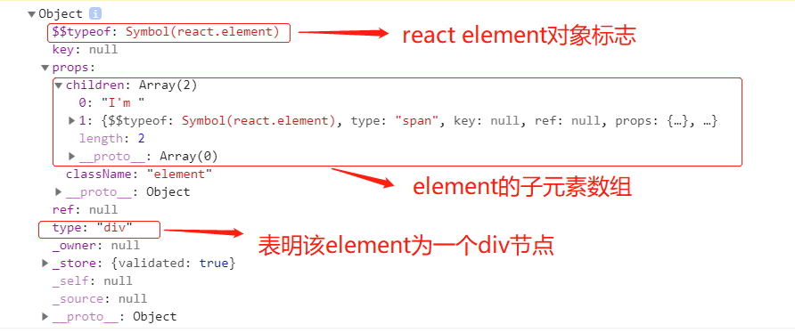
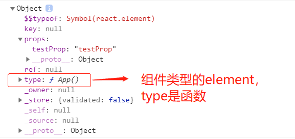
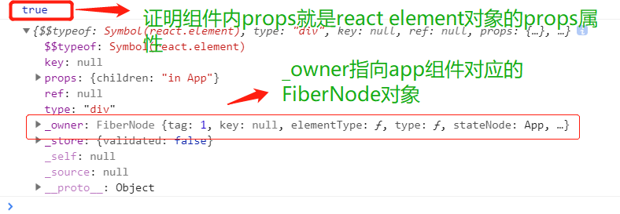

# 探索React.createElement

## 函数作用
jsx语法经过编译会变成React.createElement的函数调用，该函数用来产生一个react元素。

## 函数定义
```
React.createElement(
    type,
    [props],
    [...children]
)
```
type：既可以是一个html标签名称字符串(例如'div' 或 'span' )，也可以是一个 React component 类型(一个类或一个函数)。   
props: react元素的prop对象。**当元素的type是一个React component 类型时，会被传入React component**   
...children：react元素的子元素    

## 函数源码
从 [react源码入口](https://github.com/aasailan/react/blob/study/packages/react/src/React.js)（packages/react/src/React.js）可以看到createElement函数的定义如下：根据编译环境，赋值的函数稍有不同
```javascript
const React = {
  
  ...

  createElement: __DEV__ ? createElementWithValidation : createElement,
  cloneElement: __DEV__ ? cloneElementWithValidation : cloneElement,
  createFactory: __DEV__ ? createFactoryWithValidation : createFactory,
  
  ...
};
```
我们选择createElementWithValidation函数进行查看。createElementWithValidation函数定义在 [react/src/ReactElementValidator.js](https://github.com/aasailan/react/blob/study/packages/react/src/ReactElementValidator.js) 文件中
```javascript
export function createElementWithValidation(type, props, children) {
  // demo3：对type参数进行校验
  const validType = isValidElementType(type);

  // demo3: 如果type校验非法，则进行警告输出
  if (!validType) {
    ...
  }

  // demo3: 关键步骤 调用createElement函数，产生element
  const element = createElement.apply(this, arguments);

  if (element == null) {
    return element;
  }

  if (validType) {
    // demo3: 校验第二个参数以及后面的参数
    for (let i = 2; i < arguments.length; i++) {
      validateChildKeys(arguments[i], type);
    }
  }

  if (type === REACT_FRAGMENT_TYPE) {
    validateFragmentProps(element);
  } else {
    validatePropTypes(element);
  }

  return element;
}
```
可以发现，createElementWithValidation只是对 createElement 函数的一层封装，增加了一个参数校验功能，功能的核心依靠createElement函数实现

createElement函数定义在 [react/src/ReactElement.js](https://github.com/aasailan/react/blob/study/packages/react/src/ReactElement.js) 文件中
```javascript
/**
 * @description 创建react element
 * @export
 * @param {*} type element type 如果type是字符串则是dom类型元素，如果是函数则是组件类型元素
 * @param {*} config element config
 * @param {*} children element children
 * @returns
 */
export function createElement(type, config, children) {
  let propName;

  // Reserved names are extracted
  // demo3: react element对象中的props属性对象，如果react element对象是react组件类型，则props对象还会被传入react组件内
  const props = {};

  let key = null;
  let ref = null;
  let self = null;
  let source = null;

  if (config != null) {
    // demo3: 保存config中ref、key、self、source等四个特殊属性
    if (hasValidRef(config)) {
      ref = config.ref;
    }
    if (hasValidKey(config)) {
      key = '' + config.key;
    }

    self = config.__self === undefined ? null : config.__self;
    source = config.__source === undefined ? null : config.__source;
    // Remaining properties are added to a new props object
    // demo3: 将config对象中除了ref、key、self、source等四个特殊属性之外的属性复制到props对象中
    for (propName in config) {
      if (
        hasOwnProperty.call(config, propName) &&
        !RESERVED_PROPS.hasOwnProperty(propName)
      ) {
        props[propName] = config[propName];
      }
    }
  }

  // Children can be more than one argument, and those are transferred onto
  // the newly allocated props object.
  // demo3: 将createElement函数第二个及其以后的参数放入children数组，赋值到props对象
  // react组件内接受到props对象包含children数组就是来自于此
  const childrenLength = arguments.length - 2;
  if (childrenLength === 1) {
    props.children = children;
  } else if (childrenLength > 1) {
    const childArray = Array(childrenLength);
    for (let i = 0; i < childrenLength; i++) {
      childArray[i] = arguments[i + 2];
    }
    if (__DEV__) {
      if (Object.freeze) {
        // demo3: 冻结children对象，所以在开发版本中无法在子组件内修改props.children属性对象
        Object.freeze(childArray);
      }
    }
    props.children = childArray;
  }

  // Resolve default props
  // demo3: 如果type是一个react组件构造函数，可能会存在defaultProps静态属性
  // 关于defaultProps静态属性可参见官方文档 https://zh-hans.reactjs.org/docs/typechecking-with-proptypes.html#default-prop-values
  // 将defaultProps对象的属性复制到props对象
  if (type && type.defaultProps) {
    const defaultProps = type.defaultProps;
    for (propName in defaultProps) {
      if (props[propName] === undefined) {
        props[propName] = defaultProps[propName];
      }
    }
  }
  if (__DEV__) {
    if (key || ref) {
      const displayName =
        typeof type === 'function'
          ? type.displayName || type.name || 'Unknown'
          : type;
      // demo3: 对props对象定义的key和ref属性绑定一个get函数，让开发者在试图通过props对象引用
      // key和ref属性时输出一段警告
      if (key) {
        defineKeyPropWarningGetter(props, displayName);
      }
      if (ref) {
        defineRefPropWarningGetter(props, displayName);
      }
    }
  }

  // demo3: 调用ReactElement函数产生element
  return ReactElement(
    type,
    key,
    ref,
    self,
    source,
    ReactCurrentOwner.current,
    props,
  );
}
```
可以发现 createElement 函数主要做了以下几件事情：
1. 定义props对象，将config参数中除了ref、key、_self、_source等四个特殊属性之外的属性复制到props对象。并且额外定义变量保留config参数中的ref、key、_self、_source四个属性
2. 将createElement函数第二个及其以后的参数放入children数组，赋值到props对象。组件内props.children属性就是来源于此
3. 如果type是一个react组件构造函数，可能会存在defaultProps静态属性。将type.defaultProps对象的属性复制到props对象
4. 最后调用ReactElement函数创建并返回react element对象


ReactElement函数的定义在 [react/src/ReactElement.js](https://github.com/aasailan/react/blob/study/packages/react/src/ReactElement.js)中。
```javascript
/**
 * Factory method to create a new React element. This no longer adheres to
 * the class pattern, so do not use new to call it. Also, no instanceof check
 * will work. Instead test $$typeof field against Symbol.for('react.element') to check
 * if something is a React Element.
 * 工厂方法，用来创建一个新的react element对象。因为不是使用new + 构造函数来生成react element
 * 所以无法使用instanceof关键字来判断react element，需要检测对象的$$typeof属性
 * @param {*} type react element type
 * @param {*} key 
 * @param {string|object} ref
 * @param {*} self A *temporary* helper to detect places where `this` is
 * different from the `owner` when React.createElement is called, so that we
 * can warn. We want to get rid of owner and replace string `ref`s with arrow
 * functions, and as long as `this` and owner are the same, there will be no
 * change in behavior.
 * @param {*} source An annotation object (added by a transpiler or otherwise)
 * indicating filename, line number, and/or other information. 一个注释性的对象，通常由
 * 编译器添加，包含了该element定义在哪个文件，多少行等等信息
 * @param {*} owner 描述当前react元素属于哪个react组件对应的FiberNode（由哪个react组件创建）
 * @param {*} props 
 * @internal
 */
const ReactElement = function(type, key, ref, self, source, owner, props) {
  // demo3: 定义最终的react element对象
  const element = {
    // This tag allows us to uniquely identify this as a React Element
    // demo3: 添加react element标志属性
    $$typeof: REACT_ELEMENT_TYPE,

    // Built-in properties that belong on the element
    type: type,
    key: key,
    ref: ref,
    props: props,

    // Record the component responsible for creating this element.
    _owner: owner,
  };

  // demo3: 为element对象添加一些开发环境下的额外属性
  if (__DEV__) {
    // The validation flag is currently mutative. We put it on
    // an external backing store so that we can freeze the whole object.
    // This can be replaced with a WeakMap once they are implemented in
    // commonly used development environments.
    element._store = {};

    // To make comparing ReactElements easier for testing purposes, we make
    // the validation flag non-enumerable (where possible, which should
    // include every environment we run tests in), so the test framework
    // ignores it.
    Object.defineProperty(element._store, 'validated', {
      configurable: false,
      enumerable: false,
      writable: true,
      value: false,
    });
    // self and source are DEV only properties.
    Object.defineProperty(element, '_self', {
      configurable: false,
      enumerable: false,
      writable: false,
      value: self,
    });
    // Two elements created in two different places should be considered
    // equal for testing purposes and therefore we hide it from enumeration.
    Object.defineProperty(element, '_source', {
      configurable: false,
      enumerable: false,
      writable: false,
      value: source,
    });
    if (Object.freeze) {
      Object.freeze(element.props);
      Object.freeze(element);
    }
  }

  return element;
};
```
查看ReactElement函数，首先需要注意的是函数顶部的英文注释。英文注释大意如下：
>工厂方法，用来创建一个新的react element对象。因为不是使用new + 构造函数来生成react element。所以无法使用instanceof关键字来判断react element，需要**检测对象的$$typeof属性**。

ReactElement函数主要做了两件事情
1. 定义react element对象，为该对象定义$$typeof、type、key、ref、props、_owner等关键属性，所以每一个react element对象都有这五个属性
2. 如果是开发版本的代码，则为react element对象额外添加_store、_self、_source等属性。

其中根据element对象内的$$typeof属性引用的REACT_ELEMENT_TYPE变量可以判断一个对象是否属于react element。所以要进一步查看REACT_ELEMENT_TYPE变量。

REACT_ELEMENT_TYPE定义在 [./packages/shared/ReactSymbols.js](https://github.com/aasailan/react/blob/study/packages/shared/ReactSymbols.js) 中
```javascript
const hasSymbol = typeof Symbol === 'function' && Symbol.for;

// deom3: 利用Symbol或者特殊数字定义REACT_ELEMENT_TYPE，使之成为一个特殊变量，起到标志特殊对象的作用
export const REACT_ELEMENT_TYPE = hasSymbol
  ? Symbol.for('react.element')
  : 0xeac7;
export const REACT_PORTAL_TYPE = hasSymbol
  ? Symbol.for('react.portal')
  : 0xeaca;
export const REACT_FRAGMENT_TYPE = hasSymbol
  ? Symbol.for('react.fragment')
  : 0xeacb;
export const REACT_STRICT_MODE_TYPE = hasSymbol
  ? Symbol.for('react.strict_mode')
  : 0xeacc;
export const REACT_PROFILER_TYPE = hasSymbol
  ? Symbol.for('react.profiler')
  : 0xead2;
export const REACT_PROVIDER_TYPE = hasSymbol
  ? Symbol.for('react.provider')
  : 0xeacd;
export const REACT_CONTEXT_TYPE = hasSymbol
  ? Symbol.for('react.context')
  : 0xeace;
export const REACT_ASYNC_MODE_TYPE = hasSymbol
  ? Symbol.for('react.async_mode')
  : 0xeacf;
export const REACT_CONCURRENT_MODE_TYPE = hasSymbol
  ? Symbol.for('react.concurrent_mode')
  : 0xeacf;
export const REACT_FORWARD_REF_TYPE = hasSymbol
  ? Symbol.for('react.forward_ref')
  : 0xead0;
export const REACT_SUSPENSE_TYPE = hasSymbol
  ? Symbol.for('react.suspense')
  : 0xead1;
export const REACT_MEMO_TYPE = hasSymbol ? Symbol.for('react.memo') : 0xead3;
export const REACT_LAZY_TYPE = hasSymbol ? Symbol.for('react.lazy') : 0xead4;
```
可以看到该文件内主要通过Symbol或者特殊数字，来定义一系列的特殊变量。根据Symbol方法的参数可知，这些变量都是用来**标志react内一些特殊对象**用的。
比如REACT_ELEMENT_TYPE标志一个对象是react element对象

## react element对象中六个基本字段的作用
```javascript
var element = {
  $$typeof: // 用来标志这个对象是react element（以下简称element）
  type: // 说明这个element对象的类型，如果是字符串则是dom类型代表一个dom节点，如果函数则是组件类型代表一个react组件
  key: // react在做虚拟dom对比时需要用到的优化属性
  ref: // 该对象由React.createRef()创建或者是一个回调函数，通常用来引用真实的dom节点
  props: // element的配置对象，如果element属于组件类型，还会传入对应的组件
  _owner: // 当前element属于哪个组件对应的FiberNode（由哪个组件创建）
}
```

## 对比输出截图
1. createElement函数的type参数如果是字符串则产生dom类型的react element;如果是函数，则产生组件类型的react element。
```javascript
const element1 = <div className="element">I'm <span>element1</span></div>;
console.log(element1);
// 上面的jsx会被编译为下面的模式
// const element2 = React.createElement(
//   'div',
//   { // props
//     className: 'element'
//   },
//   "I'm ", // children1
//   React.createElement( // children2
//      'span',
//      null,
//      'element1'
//   )
// );
// console.log(element2);
```
输出截图：


一个组件类型react element元素的输出



2. 输出element元素内_owner字段以及传入组件内porps对象
```javascript
let app;
// 自定义一个组件
class App extends React.Component {
  render() {
    // 证明组件内的props对象来源于react element对象的props属性
    console.log(this.props === app.props); // true
    const element = (
      <div>
        in App
      </div>
    )
    // element对象由APP组件所有，输出后查看_owner字段
    console.log(element);
    return element;
  }
}
// 定义APP组件类型react element
app = <App testProp="testProp"/>;
ReactDOM.render(
  app,
  document.getElementById('react-root')
);
```
输出截图：

