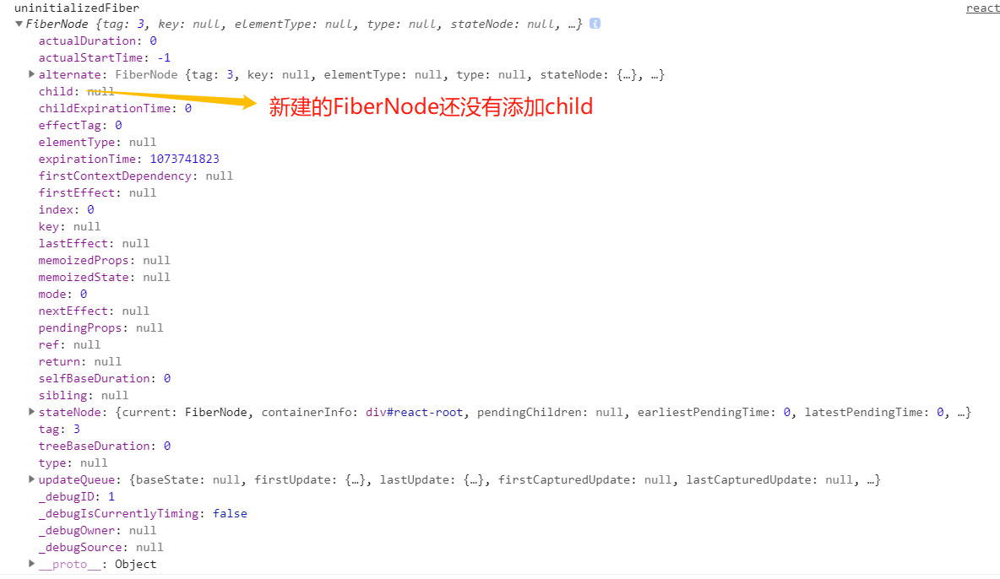
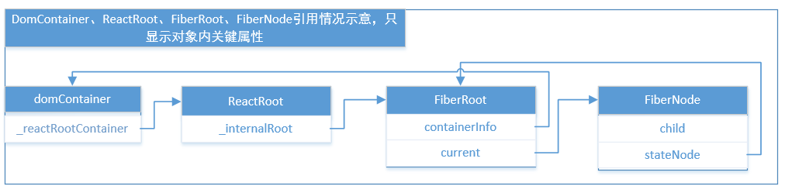
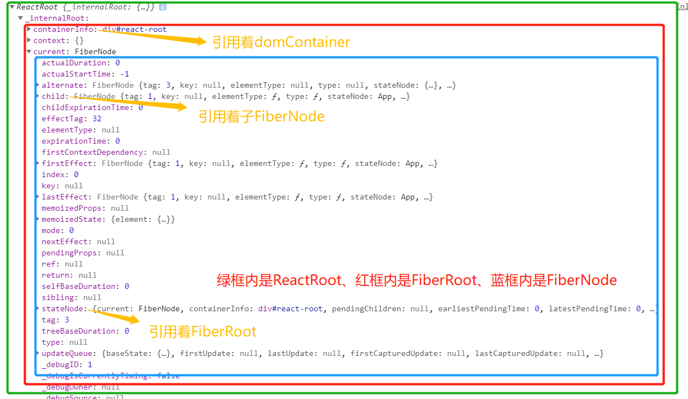
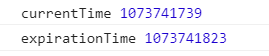

# ReactDOM.render
ReactDOM.render会将react根组件挂载到页面。ReactDOM.render函数需要同时处理服务端渲染和纯客户端渲染两种逻辑，这里**只对纯客户端渲染进行探索**。希望搞清楚在**纯客户端渲染的情况下ReactDOM.render到底做了些什么**

## 函数作用
ReactDOM.render通常是React应用的入口，将react根组件挂载到页面。

## [函数签名](https://zh-hans.reactjs.org/docs/react-dom.html#render)
```
ReactDOM.render(element, container[, callback])
```
element: 需要挂载的react element对象。
container: 充当容器的dom元素
callback: render函数运行完后的回调函数

## 函数源码
### ReactDOM.render 
ReactDOM对象定义在 [./packages/react-dom/src/client/ReactDOM.js](https://github.com/aasailan/react/blob/study/packages/react-dom/src/client/ReactDOM.js)
```javascript
// demo4: ReactDOM定义
const ReactDOM: Object = {

 ...
  /**
   * @description 将指定react element对象挂载到dom
   * @param {React$Element<any>} element 需要挂载的react element
   * @param {DOMContainer} container 充当容器的dom元素
   * @param {?Function} callback 回调函数
   * @returns
   */
  render(
    element: React$Element<any>,
    container: DOMContainer,
    callback: ?Function,
  ) {
    // demo4: 核心函数legacyRenderSubtreeIntoContainer
    // 从函数名可看出该函数会将react元素的一整颗子树都渲染进dom container
    return legacyRenderSubtreeIntoContainer(
      null,
      element,
      container,
      false,
      callback,
    );
  },

  ...
};
```
发现render函数是对legacyRenderSubtreeIntoContainer函数的一层封装。继续查看legacyRenderSubtreeIntoContainer函数

### legacyRenderSubtreeIntoContainer
legacyRenderSubtreeIntoContainer任然定义在[./packages/react-dom/src/client/ReactDOM.js](https://github.com/aasailan/react/blob/study/packages/react-dom/src/client/ReactDOM.js)中。   
legacyRenderSubtreeIntoContainer函数中做了以下几件事情
1. 对dom container对象（充当容器的dom元素）进行检查，如果不符合要求则输出警告
2. 检查dom container对象是否有**_reactRootContainer**属性，有则说明dom container已经**挂载过reactElement**，否则说明dom container第一次**挂载reactElement**。然后根据判断结果采取**不同的处理方式**。这里只关注dom container第一次**挂载reactElement**的情况
3. 如果dom container没有_reactRootContainer属性，则创建**ReactRoot对象**赋值到dom container的_reactRootContainer属性
```javascript
/**
 * @description 将一整颗子树渲染进dom container
 * @param {?React$Component<any, any>} parentComponent
 * @param {ReactNodeList} children 需要挂载的react element
 * @param {DOMContainer} container 被挂载的dom container
 * @param {boolean} forceHydrate 设置为true，将客户端渲染与服务端渲染对比拟合
 * @param {?Function} callback 渲染后回调
 * @returns
 */
function legacyRenderSubtreeIntoContainer(
  parentComponent: ?React$Component<any, any>,
  children: ReactNodeList,
  container: DOMContainer,
  forceHydrate: boolean,
  callback: ?Function,
) {
  // TODO: Ensure all entry points contain this check
  // demo4: 检查container是否是dom元素，否则输出警告
  invariant(
    isValidContainer(container),
    'Target container is not a DOM element.',
  );

  if (__DEV__) {
    topLevelUpdateWarnings(container);
  }

  // demo4: 如果container从来没有挂载过reactElement，则不会有_reactRootContainer属性
  let root: Root = (container._reactRootContainer: any);
  // demo4: 根据是container是否有挂载过reactElement，选择不同渲染方式
  if (!root) {
    // Initial mount 
    // demo4: 创建ReactRoot对象，赋值到container._reactRootContainer
    root = container._reactRootContainer = legacyCreateRootFromDOMContainer(
      container,
      forceHydrate,
    );

    // demo4: 封装callback参数
    if (typeof callback === 'function') {
      const originalCallback = callback;
      callback = function() {
        // demo4: 获取根组件实例，将回调函数的this指针绑定到根组件实例
        const instance = DOMRenderer.getPublicRootInstance(root._internalRoot);
        originalCallback.call(instance);
      };
    }

    // demo4: 为什么初始化挂载不能是批量更新
    // Initial mount should not be batched.
    DOMRenderer.unbatchedUpdates(() => {
      if (parentComponent != null) {
        root.legacy_renderSubtreeIntoContainer(
          parentComponent,
          children,
          callback,
        );
      } else {
        // demo4: 首次挂载运行root.render 在这里完成整颗组件数渲染
        root.render(children, callback);
      }
    });
  } else {
    // 已经挂载过reactElement，暂不做探究
    ...
  }

  // 返回根组件实例
  return DOMRenderer.getPublicRootInstance(root._internalRoot);
}
```
上面步骤中，有两个比较关键：
1. 调用legacyCreateRootFromDOMContainer方法创建ReactRoot对象，并赋值给domContainer._reactRootContainer。**ReactRoot对象**是个非常重要的对象，内部引用着**FiberRoot对象**进而引用着Fiber树。
2. 调用ReactRoot对象的render方法，进入整个react应用的渲染

上述代码中检查dom container的函数比较简单，就是检查dom元素的nodeType。关于dom元素的nodeType的含义可[查阅MDN文档](https://developer.mozilla.org/zh-CN/docs/Web/API/Node/nodeType).
```javascript
function isValidContainer(node) {
  return !!(
    node &&
    (node.nodeType === ELEMENT_NODE ||
      node.nodeType === DOCUMENT_NODE ||
      node.nodeType === DOCUMENT_FRAGMENT_NODE ||
      (node.nodeType === COMMENT_NODE &&
        node.nodeValue === ' react-mount-point-unstable '))
  );
}
```

接下来先进入legacyCreateRootFromDOMContainer方法查看**ReactRoot对象是如何创建的**，以及**ReactRoot对象包含了什么，有什么作用**。之后再回过头来深入查看root.render的方法调用。

legacyCreateRootFromDOMContainer方法被调用时传入了dom container和forceHydrate两个参数，由于不探究服务端渲染情况forceHydrate为false。   
legacyCreateRootFromDOMContainer定义在[./packages/react-dom/src/client/ReactDOM.js](https://github.com/aasailan/react/blob/study/packages/react-dom/src/client/ReactDOM.js)中。   
该函数主要做了三件事
1. 判断是否需要采取Hydrate操作。（纯客户端渲染的情况下不需要）
2. 不需要采取Hydrate操作的情况下，清除dom container的所有子元素
3. 调用new ReactRoot创建并返回一个ReactRoot对象
```javascript
/**
 * @description 根据dom container创建ReactRoot对象
 * @param {DOMContainer} container dom container
 * @param {boolean} forceHydrate 是否采用Hydrate操作
 * @returns {Root}
 */
function legacyCreateRootFromDOMContainer(
  container: DOMContainer,
  forceHydrate: boolean,
): Root {
  // demo4: 判断是否需要 Hydrate操作，纯客户端渲染的情况为false
  const shouldHydrate =
    forceHydrate || shouldHydrateDueToLegacyHeuristic(container);

  // demo4: 不需要Hydrate操作的情况下，清除container的所有孩子节点
  if (!shouldHydrate) {
    let warned = false;
    let rootSibling;
    while ((rootSibling = container.lastChild)) {
      container.removeChild(rootSibling);
    }
  }
  // demo4: 调用new reactRoot生成ReactRoot对象，isConcurrent表示将并发设置为false
  const isConcurrent = false;
  return new ReactRoot(container, isConcurrent, shouldHydrate);
}
```
ReactRoot是一个非常关键的对象，继续查看ReactRoot类的定义

### ReactRoot类
ReactRoot任然定义在legacyCreateRootFromDOMContainer定义在[./packages/react-dom/src/client/ReactDOM.js](https://github.com/aasailan/react/blob/study/packages/react-dom/src/client/ReactDOM.js)中。    
ReactRoot类的构造函数中调用了DOMRenderer.createContainer方法生成了**FiberRoot对象**，并将该对象赋值给ReactRoot的_internalRoot属性。    
ReactRoot的原型上还定义了render、unmount、legacy_renderSubtreeIntoContainer、createBatch四个方法，其中**render方法比较重要是整个react应用开始渲染的入口**，后面会涉及。
```javascript
/**
 * @description ReactRoot类构造函数，ReactRoot对象内部引用着fiberRoot对象
 * @param {Container} container dom container
 * @param {boolean} isConcurrent 是否需要并发
 * @param {boolean} hydrate 是否需要hydrate操作
 */
function ReactRoot(
  container: Container,
  isConcurrent: boolean,
  hydrate: boolean,
) {
  // demo4: 创建fiberRoot对象放置在_internalRoot属性
  // isConcurrent被设置为false，hydrate为false
  const root = DOMRenderer.createContainer(container, isConcurrent, hydrate);
  this._internalRoot = root;
}
```
**ReactRoot对象的作用主要有三个：**
1. 被dom container的_reactRootContainer引用，用来判断dom container是否已经挂载过reactElement
2. ReactRoot._internalRoot引用着**FiberRoot对象，FiberRoot对象是整个Fiber树的开端**。
3. ReactRoot.render方法是整个react应用渲染的入口，下面会讲到

因为FiberRoot对象是ReactRoot对象内非常重要的对象，因此继续查看DOMRenderer.createContainer   
createContainer方法定义在 [./packages/react-reconciler/src/ReactFiberReconciler.js](https://github.com/aasailan/react/blob/study/packages/react-reconciler/src/ReactFiberReconciler.js)中。createContainer只是简单调用了createFiberRoot方法来创建并返回FiberRoot对象
```javascript
export function createContainer(
  containerInfo: Container,
  isConcurrent: boolean,
  hydrate: boolean,
): OpaqueRoot {
  // 创建并返回FiberRoot对象
  return createFiberRoot(containerInfo, isConcurrent, hydrate);
}
```

### createFiberRoot
createFiberRoot定义在 [./packages/react-reconciler/src/ReactFiberRoot.js]()。
createFiberRoot主要做了两件事
1. 创建了一个FiberNode，这个FiberNode被FiberRoot对象引用，是**整个Fiber树的顶点**
2. 创建并返回FiberRoot对象
```javascript
// 创建一个FiberRoot对象
export function createFiberRoot(
  containerInfo: any,
  isConcurrent: boolean,
  hydrate: boolean,
): FiberRoot {
  // 创建一个FiberNode节点，注意命名，未初始化的FiberNode
  // 这个FiberNode对象是整颗Fiber树的顶点
  const uninitializedFiber = createHostRootFiber(isConcurrent);

  // demo4: 输出刚创建的FiberNode
  console.log('uninitializedFiber', uninitializedFiber);

  // demo4: 定义root对象作为fiberRoot节点返回
  let root;
  if (enableSchedulerTracing) {
    // 定义FiberRoot对象
    root = ({
      // 当前FiberRoot对象引用的FiberNode节点
      current: uninitializedFiber,
      // containerInfo引用的作为container的dom元素
      containerInfo: containerInfo,
      pendingChildren: null,

      earliestPendingTime: NoWork,
      latestPendingTime: NoWork,
      earliestSuspendedTime: NoWork,
      latestSuspendedTime: NoWork,
      latestPingedTime: NoWork,

      didError: false,

      pendingCommitExpirationTime: NoWork,
      finishedWork: null,
      timeoutHandle: noTimeout,
      context: null,
      pendingContext: null,
      hydrate,
      nextExpirationTimeToWorkOn: NoWork,
      expirationTime: NoWork,
      firstBatch: null,
      nextScheduledRoot: null,

      interactionThreadID: unstable_getThreadID(),
      memoizedInteractions: new Set(),
      pendingInteractionMap: new Map(),
    }: FiberRoot);
  } else {
    root = ({
      current: uninitializedFiber,
      containerInfo: containerInfo,
      pendingChildren: null,

      earliestPendingTime: NoWork,
      latestPendingTime: NoWork,
      earliestSuspendedTime: NoWork,
      latestSuspendedTime: NoWork,
      latestPingedTime: NoWork,

      didError: false,

      pendingCommitExpirationTime: NoWork,
      finishedWork: null,
      timeoutHandle: noTimeout,
      context: null,
      pendingContext: null,
      hydrate,
      nextExpirationTimeToWorkOn: NoWork,
      expirationTime: NoWork,
      firstBatch: null,
      nextScheduledRoot: null,
    }: BaseFiberRootProperties);
  }

  // FiberRoot引用的FiberNode对象的stateNode属性就是FiberRoot
  uninitializedFiber.stateNode = root;

  return ((root: any): FiberRoot);
}
```
将上述uninitializedFiber输出如下图：TODO: 输出FiberNode


createHostRootFiber定义在 [./packages/react-reconciler/src/ReactFiber.js]()。这个文件定义了很多生成Fiber节点的方法，createHostRootFiber是其中一种，它通过调用createFiber方法生成了FiberNode。createFiber方法则调用FiberNode的构造函数。FiberNode类的定义如下：
```javascript
// demo4: FIberNode类定义
function FiberNode(
  tag: WorkTag,
  pendingProps: mixed,
  key: null | string,
  mode: TypeOfMode,
) {
  // Instance
  this.tag = tag;
  this.key = key;
  this.elementType = null;
  this.type = null;
  this.stateNode = null;

  // Fiber
  this.return = null;
  this.child = null;
  this.sibling = null;
  this.index = 0;

  this.ref = null;

  this.pendingProps = pendingProps;
  this.memoizedProps = null;
  this.updateQueue = null;
  this.memoizedState = null;
  this.firstContextDependency = null;

  this.mode = mode;

  // Effects
  this.effectTag = NoEffect;
  this.nextEffect = null;

  this.firstEffect = null;
  this.lastEffect = null;

  this.expirationTime = NoWork;
  this.childExpirationTime = NoWork;

  this.alternate = null;

  if (enableProfilerTimer) {
    this.actualDuration = 0;
    this.actualStartTime = -1;
    this.selfBaseDuration = 0;
    this.treeBaseDuration = 0;
  }

  if (__DEV__) {
    this._debugID = debugCounter++;
    this._debugSource = null;
    this._debugOwner = null;
    this._debugIsCurrentlyTiming = false;
    if (!hasBadMapPolyfill && typeof Object.preventExtensions === 'function') {
      Object.preventExtensions(this);
    }
  }
}
```
至此大致明白了**ReactRoot的创建过程**。对于其中关键对象的引用情况如下:

输出ReactRoot对象截图如下：


明白了ReactRoot对象之后，回到legacyRenderSubtreeIntoContainer函数，探究root.render这句代码

### ReactRoot.prototype.render 
root.render实际上就是ReactRoot.prototype.render。
该方法主要做了两件事
1. 创建了**reactWork对象**，在reactWork对象上设置了回调函数
2. 调用了DOMRenderer.updateContainer方法，进行渲染更新
```javascript
/**
 * @description: demo4: ReactRoot对象渲染子树的入口
 * @param children 需要被渲染的react根元素
 * @param callback 渲染完后的回调函数
 */
ReactRoot.prototype.render = function(
  children: ReactNodeList,
  callback: ?() => mixed,
): Work {
  // 获取fiberRoot对象
  const root = this._internalRoot;
  const work = new ReactWork();
  callback = callback === undefined ? null : callback;
  // demo4: 设置回调函数
  if (callback !== null) {
    work.then(callback);
  }
  // demo4: 将reactElement挂载到container上
  DOMRenderer.updateContainer(children, root, null, work._onCommit);
  return work;
};
```
ReactWork类定义在 [./packages/react-dom/src/client/ReactDOM.js](https://github.com/aasailan/react/blob/study/packages/react-dom/src/client/ReactDOM.js)中，作用如下，这里不再列出代码：    
ReactWork对象内部维护一个_didCommit状态和callback队列，当_didCommit状态为false，通过原型方法 then来添加回调函数，调用原型方法_onCommit可以将_didCommit设置为true并逐一回调函数

### updateContainer
updateContainer方法定义在 [./packages/react-reconciler/src/ReactFiberReconciler.js](https://github.com/aasailan/react/blob/study/packages/react-reconciler/src/ReactFiberReconciler.js)    
updateContainer方法计算了fiber协调过程需要的expirationTime，然后调用updateContainerAtExpirationTime方法进行渲染更新。
```javascript
/**
 * @description demo4: 将reactElement挂载到dom container上
 * @export
 * @param {ReactNodeList} element 需要挂载的reactElement
 * @param {OpaqueRoot} container FiberRoot对象
 * @param {?React$Component<any, any>} parentComponent
 * @param {?Function} callback 挂载后的回调函数
 * @returns {ExpirationTime}
 */
export function updateContainer(
  element: ReactNodeList,
  container: OpaqueRoot,
  parentComponent: ?React$Component<any, any>,
  callback: ?Function,
): ExpirationTime {
  // FiberRoot对象内的FiberNode对象，fiber树的顶点
  const current = container.current;
  // 计算fiber协调过程中需要用到时间
  const currentTime = requestCurrentTime();
  const expirationTime = computeExpirationForFiber(currentTime, current);
  // 在截止时间内更新container
  return updateContainerAtExpirationTime(
    element, // 需要挂载root reactElement
    container, // FiberRoot对象
    parentComponent, // null
    expirationTime, // 截止时间
    callback, // reactWork._onCommit
  );
}
```
currentTime、expirationTime输出如下所示：

这里先不管expirationTime起什么作用以及如何计算，先继续深入updateContainerAtExpirationTime方法    
updateContainerAtExpirationTime方法为FiberRoot对象设置了context属性，然后调用了scheduleRootUpdate方法，传入了FiberRoot对象引用的FiberNode，在scheduleRootUpdate方法继续渲染操作
```javascript
/**
 * @description 在截止时间内更新container
 * @export
 * @param {ReactNodeList} element 需要被渲染的react element
 * @param {OpaqueRoot} container FiberRoot对象
 * @param {?React$Component<any, any>} parentComponent
 * @param {ExpirationTime} expirationTime 截止时间
 * @param {?Function} callback 回调函数
 * @returns
 */
export function updateContainerAtExpirationTime(
  element: ReactNodeList,
  container: OpaqueRoot,
  parentComponent: ?React$Component<any, any>,
  expirationTime: ExpirationTime,
  callback: ?Function,
) {
  // 获取fiberRoot的fiberNode节点，fiber树的顶点
  const current = container.current;
  ...
  return scheduleRootUpdate(current, element, expirationTime, callback);
}
```

### scheduleRootUpdate
scheduleRootUpdate定义在[./packages/react-reconciler/src/ReactFiberReconciler.js](https://github.com/aasailan/react/blob/study/packages/react-reconciler/src/ReactFiberReconciler.js)。  
```javascript
/**
 * @description 接受root fibernode对象、root reactElement对象，进行更新
 * @param {Fiber} current fibernode对象（fiberRoot引用的fiberNode）
 * @param {ReactNodeList} element 被挂载的root reactElement
 * @param {ExpirationTime} expirationTime 截止时间
 * @param {?Function} callback 回调函数
 * @returns
 */
function scheduleRootUpdate(
  current: Fiber,
  element: ReactNodeList,
  expirationTime: ExpirationTime,
  callback: ?Function,
) {
  // 创建一个update对象
  const update = createUpdate(expirationTime);
  // Caution: React DevTools currently depends on this property
  // being called "element".
  update.payload = {element};

  // 将回调函数设置在update对象上
  callback && (update.callback = callback)

  flushPassiveEffects();
  enqueueUpdate(current, update);
  scheduleWork(current, expirationTime);

  return expirationTime;
}
```
update对象的定义如下：
```javascript
update = {
    expirationTime: expirationTime,

    tag: UpdateState, // UpdateState变量被定义为0
    payload: null,
    callback: null,

    next: null,
    nextEffect: null,
    payload: {
      element: element // root reactElement
    }
  };
```

